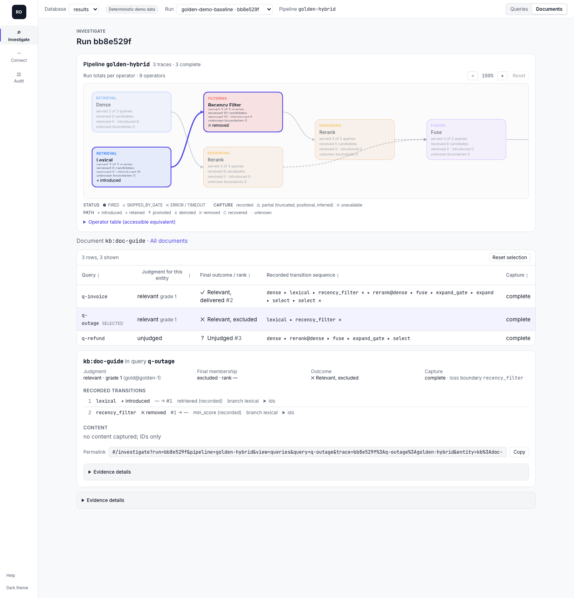

# retobs

[PyPI](https://pypi.org/project/retrieval-observatory/) · [Docs](docs/START.md) · [Migrating from 0.6](docs/guides/migrating-to-focused-retobs.md)

**Hosted demo:** pending redeploy. The read-only dashboard at
[retobs-demo.happywater-562fb4f3.westus2.azurecontainerapps.io](https://retobs-demo.happywater-562fb4f3.westus2.azurecontainerapps.io)
still serves the 0.6.0 databases, which predate the Investigate views; run the demo below
locally until it is rebuilt. See [deployment](docs/deployment.md).

A relevant document goes missing somewhere in a multi-stage retrieval pipeline. Recall drops,
and nobody can say which operator dropped it: the retriever never found it, a filter removed it,
fusion pushed it out, or the reranker cut it below `k`. retobs records what every operator
actually received and returned for each query, then shows, for each relevant document, where it
was lost and whether that is recorded or only inferred.



*`retobs demo`, baseline run: `kb:doc-guide` is judged relevant for `q-outage`, is introduced by
the lexical retriever, and is removed at `recency_filter` (reason `min_score`, recorded). The
dense branch never retrieved it, so that removal is its loss boundary.*

## Try it (no models, no keys)

```bash
pip install "retrieval-observatory[dashboard]"
retobs demo
retobs serve --db .retobs/demo/results.db     # http://127.0.0.1:4000
```

`retobs demo` evaluates a small deterministic hybrid pipeline twice: a baseline whose recency
filter loses `kb:doc-guide`, and a validation run with the filter repaired. It prints the exact
`compare`, `inspect-document`, and `inspect-query` commands for the two run IDs it created.

## The loop

### 1. Connect

```bash
pip install retrieval-observatory
```

Then give your coding agent one request, from the repository root:

> Ask your coding agent to connect retobs to this existing retrieval pipeline, run your benchmark, and open a document-flow investigation.

The agent follows the packaged runbook: plan, review, re-plan, apply, run the scenarios, verify
eight capabilities, and revert if needed ([agent runbook](docs/integrations/AGENT_QUICKSTART.md)).
By hand, start with:

```bash
retobs integrate . --phase plan --output retobs/integration-plan.json   # review, then apply and verify
```

Apply adds `@observe` to each operator and `@trace_scope` to the entrypoint; your code's return
values, order, and exceptions are unchanged. To wire a pipeline yourself, see
[manual instrumentation](docs/guides/manual-instrumentation.md).

### 2. Investigate

```bash
retobs evaluate app/search.py:retrieve --queries data/queries.jsonl --qrels data/qrels.jsonl \
  --corpus data/corpus.jsonl --name search --db .retobs/results.db
retobs serve --db .retobs/results.db
```

Open `#/investigate` for the run: the executed pipeline, each query's candidates, and for each
document its judgment, final outcome (`relevant_delivered`, `relevant_excluded`,
`retained_below_cutoff`, `not_observed`, `judged_nonrelevant`, `unjudged`,
`insufficient_evidence`), recorded transitions, and loss boundary. Without a browser:

```bash
retobs inspect-document RUN_ID kb:doc-guide --db .retobs/results.db
retobs inspect-query RUN_ID QUERY_ID --db .retobs/results.db
```

Walkthrough: [investigate your pipeline](docs/guides/investigate-your-pipeline.md).

### 3. Audit

```bash
retobs compare BASELINE CANDIDATE --db .retobs/results.db --policy retobs/release-policy.yaml \
  --artifacts artifacts/ --fail-on hold-or-block-or-fail
```

One release audit (`release-audit.json` and a standalone `release-audit.html`) is shared by the
CLI, SDK, MCP, dashboard (`#/audit`), and CI. With `--fail-on hold-or-block-or-fail` the exit code
is the decision:

| Exit | Decision | Meaning |
|---|---|---|
| 0 | `PASS` | Every declared check proves non-inferiority within its tolerance. |
| 1 | `FAIL` | A declared check proves a regression, or the failure-rate cap is exceeded. |
| 2 | `BLOCK` | Required evidence is missing or the runs are not comparable. |
| 3 | `HOLD` | Valid evidence, but inconclusive. |
| 64 / 70 | none | Usage error / the comparison could not be produced. |

Policies are local YAML (schema v3) with semantic selectors such as `target: final_retrieval`.
On the demo, the packaged policy passes. See
[retrieval release decisions](docs/guides/retrieval-release-decisions.md).

## Support boundary

What has been measured: the full connect, verify, evaluate, and investigate loop runs against an
installed wheel on five fixtures: a plain Python callable, a FastAPI hybrid pipeline with a gate,
a LangChain retriever, a LlamaIndex retriever, and a class-based multi-module hybrid pipeline. An
agent trial on an unfamiliar repository has not been recorded yet. A pipeline observed only at
its final output (a remote endpoint, an uninstrumented function) supports evaluation and
delivered/missed outcomes, not loss boundaries. Details: [integration support](docs/INTEGRATIONS.md)
and [evidence limitations](docs/guides/evidence-limitations.md).

retobs is not an answer evaluator, a leaderboard, or a production monitoring system. 0.7.0
removed synthetic test-set generation, the difficulty classifier, recommendations, counterfactual
replay and attribution, drift and hotspot monitoring, and tradeoff views; the
[migration guide](docs/guides/migrating-to-focused-retobs.md) lists replacements and the pinned
0.6.0 reproduction.

## Privacy

Queries, candidates, metadata, judgments, and traces may be sensitive. Redaction runs before
persistence. `retobs serve` binds to `127.0.0.1` and is unauthenticated; put it behind trusted
controls before exposing it. Read [privacy](docs/PRIVACY.md) and [security](SECURITY.md).

## Documentation

- [Start](docs/START.md) · [Workflow](docs/WORKFLOW.md) · [Concepts](docs/CONCEPTS.md) · [Reference](docs/REFERENCE.md)
- [Guides](docs/guides/README.md) · [Architecture](docs/ARCHITECTURE.md) · [Known limitations](FUTURE_WORK.md)
- Historical experiments (produced with 0.6.0 and earlier, not regenerated):
  [BEIR benchmark results](results/RESULTS_OVERVIEW.md), [flagship case study](results/flagship_demo/CASE_STUDY.md)
- [Releases](https://github.com/AmeyaKI/retrieval-observatory/releases)

License: [MIT](LICENSE).
