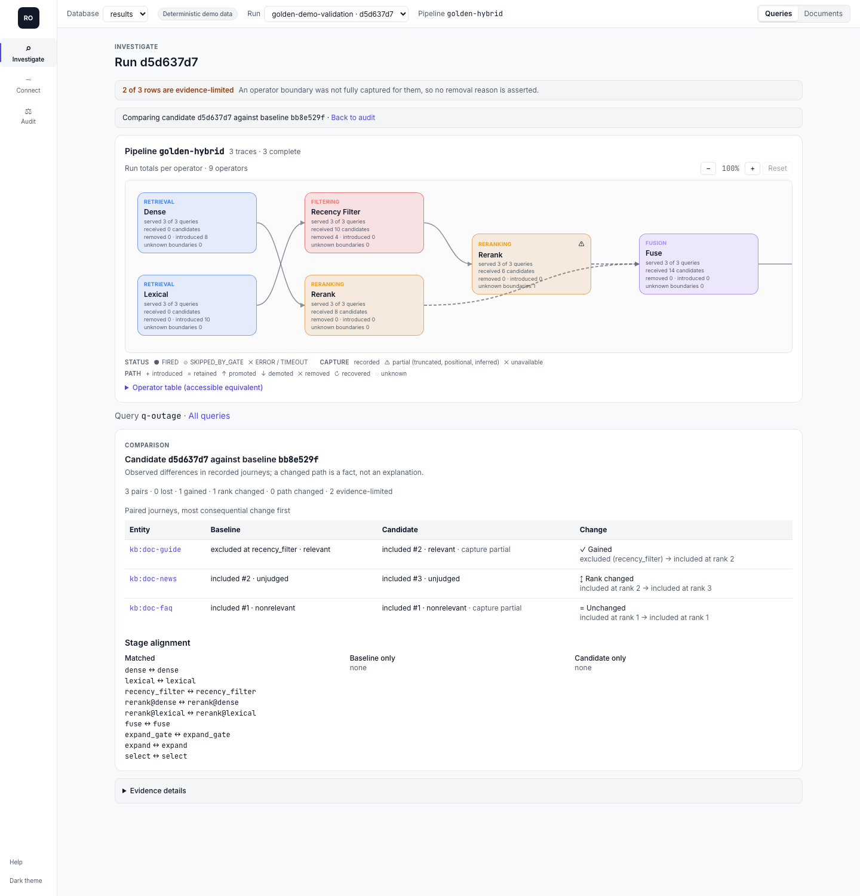

# Investigate your pipeline

Investigate answers one question: for a query in a Run, where did each relevant document go? It
starts from a Run, narrows to a query's candidates, and ends at one document's journey through
the operators that actually ran. This guide walks the path on `retobs demo`, where the relevant
document `kb:doc-guide` goes missing for query `q-outage`.

```bash
pip install "retrieval-observatory[dashboard]"
retobs demo
retobs serve --db .retobs/demo/results.db
```

`retobs demo` writes two deterministic Runs of a small hybrid pipeline (no models, no network):
a baseline whose recency filter uses `min_score: 0.85`, and a validation Run with the filter
repaired to `0.30`. It prints the exact `compare`, `inspect-document`, and `inspect-query`
commands for the two Run IDs it just created, which differ on every invocation. Below they are
written `BASELINE` and `VALIDATION`.


## 1. From a Run to its queries

Open `#/investigate?db=results&run=BASELINE&pipeline=golden-hybrid&view=queries`. The scope
lives in the URL (`db`, `run`, `pipeline`, `view=queries|documents`, `query`, `trace`, `entity`,
`stage`, `outcome`, `compare`), so any view is a link you can paste into an issue.

The page has two parts that stay synchronized:

- **The pipeline diagram.** The operators this Run executed, laid out from the recorded traces,
  not from a config file. Each node shows how many queries it served out of the Run's total,
  how many candidates it received, and how many it removed or introduced. A gated operator that
  did not run for a query is shown as skipped (`served 1 of 3 queries` for the demo's `expand`),
  never as a zero. Repeated invocations of one operator (the demo's `rerank@dense` and
  `rerank@lexical`) collapse under their stable operator id with an expand control. The
  "Operator table" below the diagram is the same data as an accessible table.
- **One primary table.** For `view=queries` it lists each query with its delivered and missed
  relevant documents, unjudged inclusions, rows with unknown capture, and the loss boundaries
  seen. Selecting a query narrows the table to that query's candidates.

The same list is available without a browser:

```bash
retobs inspect-query BASELINE q-outage --db .retobs/demo/results.db
```

## 2. From a query to its candidates

Select `q-outage` ("why is the site down"). The table now has one row per evaluated document for
that query, each with its judgment, final outcome and rank, the recorded transition sequence,
and its capture state. In the demo baseline:

| Document | Judgment | Outcome | Loss boundary |
|---|---|---|---|
| `kb:doc-guide` | relevant, grade 1 | `relevant_excluded` | `recency_filter` |
| `kb:doc-faq` | nonrelevant, grade 0 | `judged_nonrelevant` (delivered at rank 1) | none |
| `kb:doc-news` | none | `unjudged` (delivered at rank 2) | none |

Selecting a diagram node or an outcome adds a removable filter chip (`stage=`, `outcome=` in the
URL); one reset clears every filter.

### Outcomes

Every row ends in one of seven outcomes at the evaluated boundary (by default the final
retrieval output, top `k`):

| Outcome | Meaning |
|---|---|
| `relevant_delivered` | Judged relevant and included at rank `<= k`. |
| `relevant_excluded` | Judged relevant, observed somewhere in the trace, and not delivered. The loss boundary names the operator whose recorded removal took it off the path. |
| `retained_below_cutoff` | In the final output, but ranked below `k`. Not a removal. |
| `not_observed` | Judged relevant but never present in any captured boundary. When every source boundary was captured completely this is a retrieval miss; otherwise it is only "not seen". |
| `judged_nonrelevant` | Explicitly judged below the relevance threshold (grade 0 included). |
| `unjudged` | No judgment exists for this query and document. It is never counted as nonrelevant. |
| `insufficient_evidence` | A boundary it crossed was not fully captured, so its fate cannot be stated. |

No outcome is called harmful by itself: a nonrelevant document removed by a filter is simply
`judged_nonrelevant`.

## 3. From a document to its journey

Select the `kb:doc-guide` row (or open `view=documents&entity=kb:doc-guide` to see the same
document across every query of the Run). The detail panel lists the ordered transitions:

```text
1  lexical         introduced   rank - -> 1   retrieved (recorded)   branch lexical
2  recency_filter  removed      rank 1 -> -   min_score (recorded)   branch lexical
```

The dense branch never retrieved it for this query, so the lexical branch was its only path, and
the recency filter's recorded `min_score` decision removed it. That is the loss boundary. The
diagram highlights the same path.

From the command line:

```bash
retobs inspect-document BASELINE kb:doc-guide --db .retobs/demo/results.db
```

It prints the document's outcome and loss boundary for every query in the Run (for the demo:
excluded at `recency_filter` for `q-outage`, delivered at rank 2 for `q-invoice`, unjudged at
rank 3 for `q-refund`). Pass `--unit chunk` to follow chunks instead of documents, `--k` to
evaluate at another cutoff, and `--format json` for the full envelope.

### Event kinds

Each row in a journey is one event at one operator invocation:

| Kind | Recorded when |
|---|---|
| `introduced` | Absent from the operator's inputs, present in its output (a source, or an expansion adding it). |
| `retained` | In the input and the output at the same rank. Deduplicating two input occurrences into one output is `retained` with reason `deduplicated`. |
| `promoted` / `demoted` | In the input and the output at a better or worse rank. Never a removal. |
| `removed` | In the input and absent from a completely captured output. |
| `recovered` | Reintroduced after an earlier removal in the same trace (in the demo, `q-invoice`'s chunk `doc-guide/chunk-2` is removed at `recency_filter` and reintroduced by `expand`). |
| `transformed` | The output maps it to child entities. Provenance only; judgments are not inherited. |
| `unknown` | The output was truncated or the input was not captured, so no transition is asserted. |

A removal on one branch is not a final loss when another branch still carries the document:
the demo's `q-refund` loses `kb:doc-policy` on the lexical branch and still delivers it through
dense retrieval.

### Recorded or inferred

Each event says where its evidence came from. `recorded` means the operator's own boundary was
captured (its actual arguments and its returned object, or a reason the code reported).
`inferred` means retobs reconstructed it, for example inputs taken from a parent span's output
or a rank cutoff derived from recorded ranks; it is labeled as such and never presented as
recorded. `unavailable` means there is nothing to show. The same labels appear on each operator
in the diagram as its input and output capture (`recorded`, `positional`, `inferred`,
`truncated`, `unavailable`).

### The loss boundary

The loss boundary is the last recorded removal on the document's path to the evaluated
boundary. It is a fact about what the trace shows, not a causal claim: if a different operator
upstream had changed its ranking, the document might never have reached the filter at all.
When several branch exits together prevent delivery, all of them are listed. It is
`not_observed` when the document appears in no captured boundary, and `unknown` when its exit
crossed an incomplete boundary.

## 4. Confirm a fix against the baseline

Open the validation Run with `compare=BASELINE`:

```text
#/investigate?db=results&run=VALIDATION&pipeline=golden-hybrid&view=queries&query=q-outage&compare=BASELINE
```



Journeys are joined on query, namespace, unit, and entity (never on text) and sorted with final
outcome changes first. For `q-outage`, `kb:doc-guide` is `Gained` (excluded at `recency_filter`,
now included at rank 2), `kb:doc-news` changed rank, and `kb:doc-faq` is unchanged. Stages are
aligned by operator id. If the corpus changed between the Runs, matched claims are blocked and
the two paths are shown side by side.

Whether the fix is good enough to ship is an Audit question, answered against a declared policy:
see [retrieval release decisions](retrieval-release-decisions.md).

## Your own pipeline

Investigate needs a Run whose traces record each operator's inputs and outputs:

```bash
retobs evaluate app/search.py:retrieve --queries data/queries.jsonl --qrels data/qrels.jsonl \
  --corpus data/corpus.jsonl --name my-pipeline --db .retobs/results.db
retobs serve --db .retobs/results.db
```

`retrieve` is your instrumented entrypoint (see [Connect](../integrations/AGENT_QUICKSTART.md) or
the [manual instrumentation guide](manual-instrumentation.md)). An uninstrumented callable still
evaluates, but only its final output is observed, so Investigate can say whether a relevant
document was delivered and not where it was lost.

`retobs evaluate` builds the investigation rows when the Run finishes. For a database written by
an earlier version, migrate it and index the Run explicitly:

```bash
retobs storage migrate --db .retobs/results.db        # additive; copies the file first
retobs storage index RUN_ID --db .retobs/results.db   # add --pipeline when the Run has several
```

The HTTP routes behind these views are `GET /dbs/{db}/investigation/runs/{run}/queries[/{query}]`,
`.../documents[/{entity}]`, and `.../compare?against=BASELINE`; `POST .../projection` builds the
rows explicitly. GET never writes. The SDK equivalents are `inspect_query` and `inspect_document`,
and the MCP tools have the same names.

What each outcome can and cannot claim, and how capture gaps show up, is in
[evidence limitations](evidence-limitations.md).
