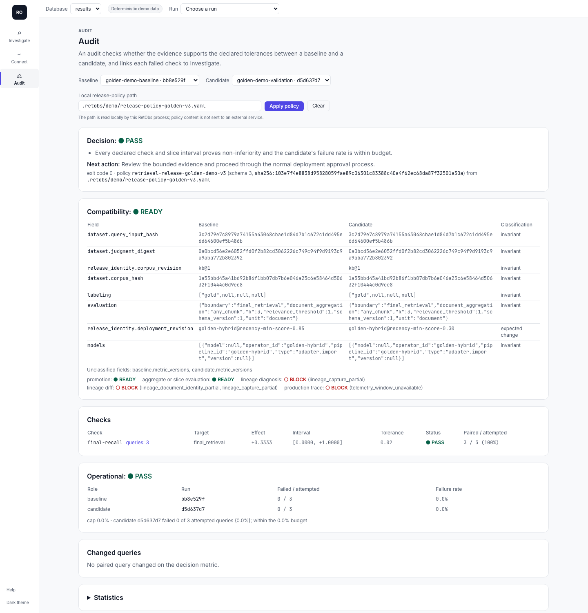

# Retrieval release decisions

retobs is a local-first evidence layer for retrieval changes. It evaluates recorded baseline/candidate evidence under a bounded, versioned policy and returns one of four outcomes. It does not deploy a model, score generated answers, or claim that a changed retrieval path caused a metric change.

## Define the bounded policy

Start from [`examples/ci/release-policy-v3.yaml`](../../examples/ci/release-policy-v3.yaml). A v3
policy declares what the Runs evaluate (`evaluation`: unit, boundary, `k`, relevance threshold),
the change under test (`intervention.expected_changes`), statistics (confidence, resamples, seed,
`min_pair_coverage`), the checks, optional slices, and a failure-rate cap
(`execution.max_failure_rate`). Each check names its target by meaning, not position:

```yaml
metrics:
  - id: final-recall
    metric: recall
    target: final_retrieval        # or: query, operator:<op_id>
    direction: higher_is_better
    max_regression: 0.02
    min_paired_n: 200
```

Selectors are resolved against both Runs before anything is evaluated; one that is absent or
ambiguous blocks the decision (`metric_selector_unresolved`). Slices use exact values on top-level
query metadata fields. Policies accept no expressions, regular expressions, SQL, or Python. A v2
policy (positional `pipeline|stageN|metric@k` keys) still loads and is converted per comparison;
see [migrating to focused retobs](migrating-to-focused-retobs.md#release-policies-v2-to-v3).

Keep the policy in version control. Its digest appears in the audit, so a policy change cannot
hide inside a candidate comparison.

## Compare and inspect locally

```bash
retobs compare BASELINE CANDIDATE --db .retobs/results.db --policy retobs/release-policy.yaml \
  --artifacts artifacts/ --fail-on hold-or-block-or-fail
retobs serve --db .retobs/results.db
```

On `retobs demo` output, the packaged policy (copied to `.retobs/demo/release-policy-golden-v3.yaml`)
gives `PASS` for the baseline against the validation Run: final recall@3 improves by +0.33 over
three paired queries, with no failed queries.



`--artifacts` writes `release-audit.json` and a standalone `release-audit.html`. Review them
before uploading: Run IDs and recorded metadata may be sensitive. The dashboard binds to
`127.0.0.1` by default.

In the dashboard, open `#/audit?db=DB&baseline=BASELINE&candidate=CANDIDATE`, enter the policy's
local path in **Local release-policy path**, and select **Apply policy** (the path is kept in the
URL as `policy=`). The retobs process reads the file and returns the same audit as the CLI, SDK,
MCP, and CI; the browser does not derive a status. The audit lists compatibility of the two Runs,
each check with its effect, interval, tolerance, and paired/attempted counts, slices, the
failure-rate accounting, and the changed queries, each with an "Open in Investigate" link that
opens `#/investigate?...&compare=BASELINE` for that query.

## Interpret the decision

| Status | Bounded meaning |
|---|---|
| `PASS` | Every declared check and slice interval proves non-inferiority within its tolerance, and the candidate's failure rate is within the cap. |
| `HOLD` | The evidence is valid but cannot prove pass or fail: too few pairs, pair coverage below the minimum, an interval that crosses the tolerance, or an undeclared change to review. |
| `BLOCK` | Required evidence is absent or the Runs are not comparable: different query inputs, judgments, corpus, or evaluation unit and `k`; an unresolved selector; unknown attempt accounting. |
| `FAIL` | Valid evidence proves a regression beyond a declared tolerance, or the failure-rate cap is exceeded. |

The decision is the most severe check result (`BLOCK` > `FAIL` > `HOLD` > `PASS`), and every
result is kept in the audit. `PASS` does not mean universally safe, causally explained, or
automatically deployable. It means the recorded evidence supports promotion under this policy.
[Evidence limitations](evidence-limitations.md#what-an-audit-certifies) lists what an audit does
and does not certify.

## Keep readiness scoped to the claim

Promotion, aggregate or slice evaluation, lineage diagnosis, lineage diff, and production-trace
claims have separate readiness. A comparison can pass promotion while lineage diagnosis is blocked
because final outputs are sufficient for the policy but some operator boundaries were only
partially captured (the demo shows exactly this). Missing lineage evidence blocks the decision only
when the policy requires it (`evidence.require_lineage_for_decision`).

Document-level judgments do not silently become chunk-level labels: chunk results are scored
against judged documents only through an explicit chunk map (`--chunk-map`).

## CI

The [example workflow](../../examples/ci/retrieval-ci.yml) evaluates the candidate, compares it with a repository-selected baseline, always uploads the release audit, and fails the job on `HOLD`, `BLOCK`, or `FAIL` while reporting a tool error separately. It requires no hosted retobs service or retobs secret. Your dataset, model, or external provider may have separate credentials and data-handling requirements.

### Exit codes

`retobs compare --fail-on hold-or-block-or-fail` exits with the decision's own code, so CI can tell the outcomes apart; `--fail-on fail` exits nonzero only on `FAIL`, and the default `--fail-on never` exits 0 whenever a decision was produced.

| Exit | Meaning |
|---|---|
| `0` | `PASS`, or the decision is not gated by `--fail-on` |
| `1` | `FAIL` |
| `2` | `BLOCK` (also a command-line usage error such as a missing run ID, reported by the argument parser) |
| `3` | `HOLD` |
| `64` | Invalid `--fail-on` or `--format` value |
| `70` | Tool error: the comparison could not be produced (run not found, invalid policy); no decision and no artifact |

Compatibility: earlier releases exited `1` for every gated `HOLD`, `BLOCK`, or `FAIL`, `2` for an invalid option value, and `1` for a tool error. `--artifacts DIR` writes `release-audit.json` and the standalone `release-audit.html` before the exit status is chosen, so a gated run still leaves its audit behind.

retobs complements general tracing, experiment tracking, and evaluation systems by adding this retrieval-specific policy and lineage boundary. It does not claim broader observability coverage or replace those systems.
