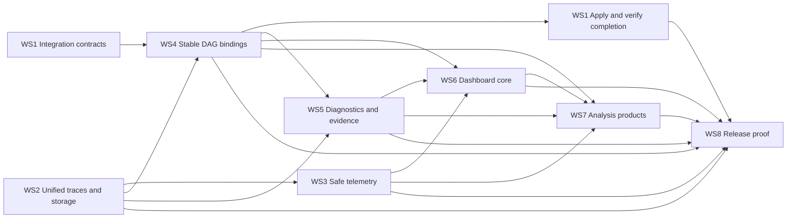

# Retrieval Observatory Audit Remediation Master Implementation Plan

> **For agentic workers:** REQUIRED SUB-SKILL: Use superpowers:subagent-driven-development (recommended) or superpowers:executing-plans to implement this plan task-by-task. Steps use checkbox (`- [ ]`) syntax for tracking.

**Goal:** Resolve every finding in `RETOBS_EXTERNAL_AUDIT_2026-07-15.md` through a clean beta reset that delivers one agent-friendly integration workflow, one faithful trace/storage model, safe telemetry, correct retrieval diagnostics, scalable investigation, and release-grade proof.

**Architecture:** Eight workstreams are sequenced around a small set of contracts: integration manifest, unified trace identity, bounded telemetry, parent-grouped DAG evidence, typed findings, URL-backed dashboard context, shared analysis responses, and a machine-checked public surface. Each workstream has an implementation-ready subplan and an independently testable completion gate.

**Tech Stack:** Python 3.10+, asyncio, Typer, FastAPI, SQLite, PostgreSQL, Pydantic/dataclasses already used by the repository, React, TypeScript, Vite, Vitest, Recharts, pytest, browser tests, Python wheel packaging, GitHub Actions.

## Global Constraints

- This is a clean beta reset; do not preserve deprecated commands, aliases, tools, routes, schemas, V1 models, or public legacy product vocabulary.
- The only public integration workflow is `retobs integrate <project>` and MCP `integrate_project`, each with `plan`, `apply`, and `verify` phases.
- The host application remains the pipeline runtime; retobs is an observability and evaluation layer.
- Telemetry cannot fail a retrieval request, block indefinitely, or grow memory without bounds.
- Evaluation and Production use one trace, operator, candidate, corpus, dataset, and index identity model.
- Every metric, finding, recommendation, chart, check, and alert declares evidence, method/version, scope, limitations, and unavailable reason.
- Dashboard serving binds to `127.0.0.1` unless the user explicitly requests remote exposure.
- No workstream is complete without tests against the installed wheel and representative live product behavior where applicable.
- Meaningful user-visible or architectural changes add one concise `[Unreleased]` entry to `CHANGELOG.md`.

---

## Planning set

| Order | Workstream | Detailed plan | Primary outcome |
|---:|---|---|---|
| 0 | Approved architecture | [`00_DESIGN.md`](00_DESIGN.md) | Authoritative product and engineering decisions |
| 1 | Public integration | [`01_INTEGRATION_PLAN.md`](01_INTEGRATION_PLAN.md) | Real plan/apply/verify workflow with symbol-aware patches |
| 2 | Unified traces/storage | [`02_TRACE_STORAGE_PLAN.md`](02_TRACE_STORAGE_PLAN.md) | One production/evaluation trace model and typed store |
| 3 | Safe telemetry | [`03_TELEMETRY_PLAN.md`](03_TELEMETRY_PLAN.md) | Bounded, asynchronous, failure-isolated capture |
| 4 | DAG and adapters | [`04_DAG_ADAPTERS_PLAN.md`](04_DAG_ADAPTERS_PLAN.md) | Stable identity, real parentage, and typed operator semantics |
| 5 | Diagnostics/evidence | [`05_DIAGNOSTICS_EVIDENCE_PLAN.md`](05_DIAGNOSTICS_EVIDENCE_PLAN.md) | Trace-native causal diagnostics with unavailable states |
| 6 | Dashboard core | [`06_DASHBOARD_CORE_PLAN.md`](06_DASHBOARD_CORE_PLAN.md) | URL-backed global context and scalable investigation UX |
| 7 | Analysis products | [`07_ANALYSIS_PRODUCTS_PLAN.md`](07_ANALYSIS_PRODUCTS_PLAN.md) | Eight evidence-aware retrieval analysis capabilities |
| 8 | Release proof | [`08_RELEASE_PLAN.md`](08_RELEASE_PLAN.md) | Clean public surface, wheel-only external fixtures, and promotion gates |

## Dependency graph



Workstream numbers describe ownership, not a strictly serial schedule. Contract-first tasks may run in parallel when their consumed interfaces are already committed. The master execution order below identifies safe concurrency.

## Program execution phases

### Phase A: Freeze shared contracts

**Objective:** Establish names and types that all later work consumes.

- [x] Complete the trace identity/model contract from Workstream 2.
- [x] Complete the integration manifest and plan/result contracts from Workstream 1.
- [x] Complete the discriminated operator schema and parent-grouped candidate contract from Workstream 4.
- [x] Complete the shared diagnostic evidence model from Workstream 5.
- [x] Add the machine-readable public-surface contract from Workstream 8.

**Gate:** Contract tests compile and pass without a V1 type, random operator identity, generic apply result, or untyped finding payload.

**Safe parallelism:** The five contract tasks may be implemented concurrently only after their exact cross-references are reconciled in review.

### Phase B: Unify persistence and execution truth

**Objective:** Make the sole trace the canonical record for evaluation and Production.

- [ ] Implement the unified SQLite/PostgreSQL store protocol and schema reset behavior.
- [ ] Port evaluation execution, metrics, query evidence, and Production APIs to unified traces.
- [ ] Implement typed operator executors and explicit gate/skip/drop semantics.
- [ ] Delete V1 models, recorders, tables, lift/migration paths, and compatibility branches in the same reviewed changes that replace them.

**Gate:** A production trace with no run ID is queryable in Production, an evaluation trace with a run ID computes metrics, and SQLite/PostgreSQL contract tests return identical domain objects.

### Phase C: Make observation safe and framework-faithful

**Objective:** Ensure instrumentation cannot hurt the host application and adapters preserve the real graph.

- [ ] Implement normalization, redaction, payload limits, and capture metadata.
- [ ] Implement the bounded background sink, exporters, counters, retry/drop policy, and lifecycle.
- [ ] Add the manifest-aware operator registry.
- [ ] Rewrite FastAPI, LangChain, LlamaIndex, Haystack, DSPy, and OpenAI Agents integrations around the sole recorder and registry.
- [ ] Expand integration verification to prove stable identity, parentage, branch coverage, candidates, timing, and exporter health.

**Gate:** Exporter outage, serialization failure, full queue, cancellation, and shutdown deadlines do not change host responses. Repeated and concurrent framework traces preserve stable operator signatures.

### Phase D: Deliver factual diagnosis

**Objective:** Replace heuristic labels with versioned evidence rules.

- [ ] Build branch-aware candidate histories.
- [ ] Implement identity/source/branch/gate rules.
- [ ] Implement fusion/filter/rerank/truncation/final-ranking rules.
- [ ] Persist typed findings and cut runner/query/recommendation consumers over.
- [ ] Pass the complete adversarial hybrid/gated fixture suite.

**Gate:** Every registered rule returns supported, limited, unavailable, or not-observed with explicit prerequisites. `ranking_failure` is correct at a declared cutoff and unavailable when pre-truncation evidence is absent.

### Phase E: Consolidate the public integration journey

**Objective:** Make the external agent experience match the product promise.

- [ ] Complete symbol/route/operator/dataset discovery.
- [ ] Generate concrete patch operations with confidence and precondition hashes.
- [ ] Implement atomic apply and reversal metadata.
- [ ] Connect verify to manifest and observation health.
- [ ] Expose only canonical CLI and MCP entrypoints.
- [ ] Demonstrate plan/apply/verify against the complex FastAPI hybrid fixture without changing host outputs.

**Gate:** A fresh agent can use the installed package to produce an exact reviewed patch, apply it, run representative queries, and receive a factual readiness matrix in one coherent workflow.

### Phase F: Scale existing dashboard workflows

**Objective:** Make current evidence understandable and shareable at production scale.

- [ ] Add global URL-backed database/service/run/window/cohort context.
- [ ] Make every Production subview and filter deep-linkable.
- [ ] Add paginated trace search and topology-variant summaries.
- [ ] Summarize production matches before trace drill-down.
- [ ] Separate statistical, practical, power, and release-decision states in Compare.
- [ ] Expose stable Test Set identity and generation provenance.

**Gate:** Refresh, browser navigation, direct links, global database changes, and cohort filters reproduce the same state. Large trace sets do not render unbounded selectors or opaque ID walls.

### Phase G: Add retrieval-analysis products

**Objective:** Ship the missing ML-engineering views on shared evidence contracts.

- [ ] Add shared cohort persistence and typed `AnalysisResult`.
- [ ] Add router/gate analysis.
- [ ] Add branch contribution analysis.
- [ ] Add score calibration and threshold sensitivity.
- [ ] Add latency critical-path analysis.
- [ ] Add corpus/index health.
- [ ] Add ground-truth health and label audit queue.
- [ ] Add instrumentation health.
- [ ] Add saved baselines, regression checks, and evidence-backed alerts.

**Gate:** Every analysis has positive, partial, and unavailable fixtures; no chart appears when its evidence prerequisites are absent.

### Phase H: Remove obsolete surfaces and prove the release

**Objective:** Ensure source, wheel, docs, automation, and live behavior describe exactly one product.

- [ ] Delete deprecated CLI/MCP/SDK/routes/docs/examples/tests and public legacy vocabulary.
- [ ] Add repository vocabulary and public-surface contract checks.
- [ ] Add callable, FastAPI hybrid, LangChain, and LlamaIndex external projects.
- [ ] Expand clean-wheel smoke testing from `/tmp`.
- [ ] Build the CI contract, framework, browser, and wheel matrices.
- [ ] Promote the exact tested artifact digest through TestPyPI and PyPI.
- [ ] Rewrite README, agent runbook, reference, architecture, privacy, and release checklist.
- [ ] Produce the final release evidence report.

**Gate:** The clean installed wheel passes every external fixture and live dashboard test; active source/docs contain no prohibited public vocabulary; versions and artifact digests agree.

## Audit coverage matrix

| Audit finding | Owning plan(s) | Required proof |
|---|---|---|
| Competing integration workflows | WS1, WS8 | Exact CLI/MCP public-surface tests |
| False MCP apply behavior | WS1 | Atomic plan/apply fixture with stale-plan rejection |
| Generic low-confidence agent patches | WS1, WS4 | Symbol-aware hybrid fixture and unresolved-mapping gate |
| FastAPI default `.stage()` failure | WS1, WS3, WS8 | Installed-wheel FastAPI request smoke |
| V2 traces invisible in Production | WS2, WS6, WS8 | Production-only trace round trip without run ID |
| Production verification requires a run | WS1, WS2 | Service-scoped verify contract |
| Random framework operator IDs | WS4 | Repeated/concurrent topology stability tests |
| Previous-span parent inference | WS4 | Parallel branch parentage tests |
| Verification misses cross-trace instability | WS1, WS4 | Manifest-to-observation topology checks |
| Generic DAG treats operations as rerank | WS4 | Operator-specific schema/executor tests |
| Multi-parent inputs discarded | WS4 | Parent-group round trip and execution tests |
| Request-path persistence | WS3 | Handler latency/isolation tests under slow exporter |
| No bounded queue/backpressure | WS3, WS7 | Overflow policy/counters and instrumentation health UI |
| Serialization can affect request | WS3 | Non-JSON metadata and failing exporter fixtures |
| Global monkeypatch risk | WS1, WS4 | Explicit manifest-scoped adapter bindings |
| Unreachable `ranking_failure` | WS5 | Rank 11 at `k=10` test and pre-truncation unavailable test |
| Hybrid diagnosis ambiguity | WS4, WS5 | Branch/gate/fan-in adversarial suite |
| Architecture trace selector does not scale | WS6 | Search/pagination/topology variant browser test |
| Opaque Production matches dominate query detail | WS6 | Aggregated match response and drill-down test |
| Compare decision semantics are confusing | WS6 | Decision truth table and labeled UI states |
| Production subviews are not deep-linkable | WS6 | Refresh/back/forward/direct route tests |
| Test Set queries lack visible identity/provenance | WS6, WS7 | Required provenance schema and table/browser tests |
| Multi-database context is inconsistent | WS6 | Global context persistence test |
| Missing gate/router analysis | WS7 | Gate analysis supported/unavailable contracts |
| Missing branch contribution analysis | WS7 | Overlap/unique/fusion evidence contracts |
| Missing score/threshold analysis | WS7 | Calibration and incompatible-score suppression tests |
| Missing critical-path analysis | WS7 | DAG timing aggregation and missing-component state |
| Missing corpus/index health | WS1, WS2, WS7 | Version/freshness/ACL coverage contracts |
| Missing ground-truth health | WS7 | Judgment coverage, disagreement, and audit queue tests |
| Missing instrumentation health | WS3, WS4, WS7 | Expected/observed/drop/stability dashboard contracts |
| Missing cohorts/checks/alerts | WS6, WS7 | Versioned predicates, baseline pins, check result tests |
| Unsafe `0.0.0.0` default | WS3, WS8 | CLI/default bind contract |
| Market positioning overclaims uniqueness | WS8 | Factual README/PyPI vocabulary checks |
| Full-suite native abort obscures release confidence | WS8 | Isolated dependency/framework CI and wheel matrix |

## Cross-workstream interface freeze

Before Phase B begins, reviewers must verify these names and meanings across all subplans:

```python
integrate_project(project_root: Path, phase: IntegrationPhase, options: IntegrationOptions) -> IntegrationResult
IntegrationPhase = Literal["plan", "apply", "verify"]

RetrievalTrace(
    service_id: str,
    pipeline_id: str,
    trace_id: str,
    query_id: str,
    run_id: str | None,
    spans: tuple[OperatorSpan, ...],
    capture: CaptureMetadata,
)

OperatorSpan.input_groups: Mapping[str, tuple[Candidate, ...]]

BaseStore.list_traces(query: TraceQuery) -> list[RetrievalTrace]

BufferedTraceSink.offer(trace: RetrievalTrace) -> bool

DiagnosticEngine.evaluate(context: DiagnosticContext) -> tuple[DiagnosticFinding, ...]

AnalysisResult[T](
    state: Literal["ready", "partial", "unavailable"],
    data: T | None,
    evidence: EvidenceDescriptor,
    scope: AnalysisScope,
    unavailable_reason: str | None,
)
```

Any implementation that changes these interfaces must update every consuming plan before code review approval.

## Review and commit discipline

- One task equals one independently reviewable behavior change and its tests/docs.
- Every task begins with a failing test and records the expected failure.
- Each task commits only its declared files plus directly required changelog/docs changes.
- Do not combine legacy deletion with unrelated formatting or refactoring.
- At the end of every phase, run the workstream completion gates before starting dependents.
- Keep a release evidence record of commands, exact versions, results, and artifacts; do not summarize a failed or skipped gate as passing.

## Program completion gate

Run the exact commands defined in Workstream 8. Completion additionally requires:

```bash
git diff --check
python scripts/check_public_vocabulary.py
python scripts/check_release.py --require-assets --require-wheel dist/*.whl
pytest tests/unit tests/contracts tests/integration -v --tb=short
python scripts/smoke_external_project.py --wheel dist/*.whl --all
npm run test --prefix retrieval_observatory/dashboard/ui -- --run
npm run build --prefix retrieval_observatory/dashboard/ui
pytest tests/browser -v --tb=short
```

Expected: every command exits `0`; the external hybrid fixture proves stable gate/branch/fusion/filter/rerank topology and unchanged host responses; the installed wheel serves the dashboard on loopback; no active public surface contains a removed command, model, route, tool, or product vocabulary.
